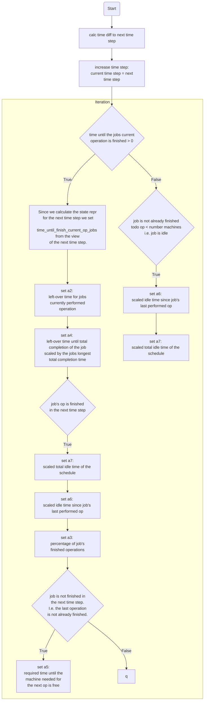

```mermaid
flowchart TB
  a(Start) --> b[calc time diff to next time step]
  b --> c[increase time step:\n current time step = next time step]
  c --> d{time until the jobs current \n operation is finished > 0}

      subgraph one[Iteration]

    d --True--> e[Since we calculate the state repr\n for the next time step we set\n time_until_finish_current_op_jobs from the view\n of the next time step.]
    e --> g[set a2: \nleft-over time for jobs\n currently performed operation]
    g -->  j[set a4: \nleft-over time until total \n completion of the job \n scaled by the jobs longest total completion time]
    j --> k{job's op is finished \n in the next time step}
      k --True--> l[set a7:\nscaled total idle time of the schedule]
      l --> m[set a6: \nscaled idle time since job's last performed op]
      m --> n[set a3: \n percentage of job's finished operations]

      n --> o{job is not finished in \nthe next time step. \nI.e. the last operation \nis not already finished.}
        o --True--> p[set a5: \nrequired time until the\n machine needed for\n the next op is free]
        o --False--> q
  d --False--> f{job is not already finished\n todo op < number machines \n i.e. job is idle}
    f --True--> h[set a6: \nscaled idle time since job's last performed op]
    h --> i[set a7: \nscaled total idle time of the schedule]


  end
```